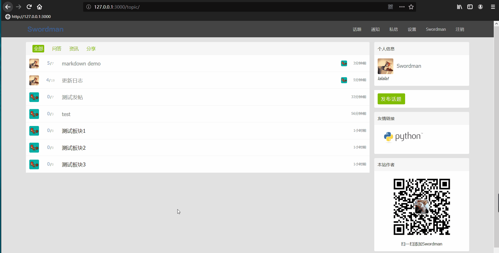
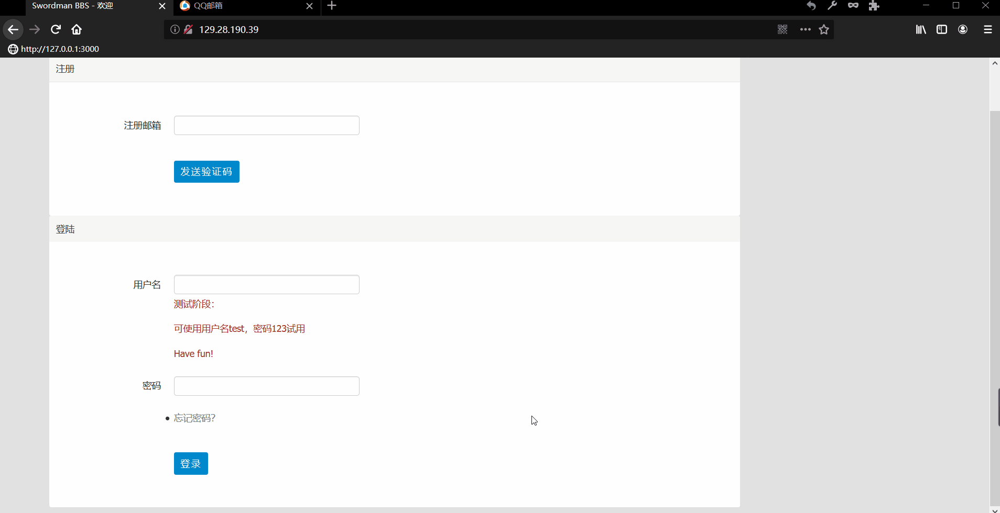
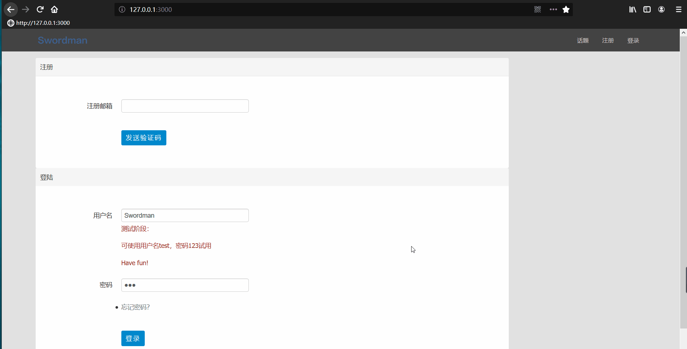
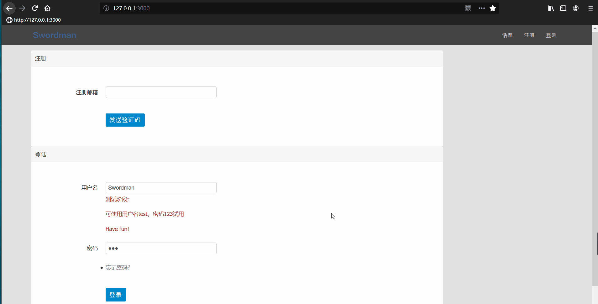

已上线 http://129.28.190.39/
欢迎访问。

示例动图加载较慢，请耐心等待。

## 基于Flask的个人论坛
数据存储使用MySQL，ORM使用SQLAlchemy，模板使用jinja2，使用Redis进行缓存优化。

**主要功能**
- 用户登陆、个人主页、信息管理功能；
- 话题的编辑、发布、删除、评论，支持@用户功能；
- 邮件通知与系统消息通知功能，用户间支持私信功能，支持系统消息和私信的批量管理；
- 使用邮箱注册，使用注册邮箱找回密码。

**安全与优化**
- 实现对CSRF、XSS、SQL注入攻击的防御；
- 使用服务器端Session实现用户登录、登出；Session和页面Token使用redis进行存储，以支持多进程间数据共享；
- 变动频率较低的数据实现基于 Redis 的缓存优化，后续请求命中缓存时不需进行数据库操作，实现性能优化，减轻数据库访问压力。

**项目部署**
- 使用nginx 进行反向代理，过滤静态资源请求；
- 使用gunicorn多worker + gevent协程架构。

## 详细
### 个人主页与设置

### 找回密码示例

### 登录与话题操作

### 私信与系统通知

